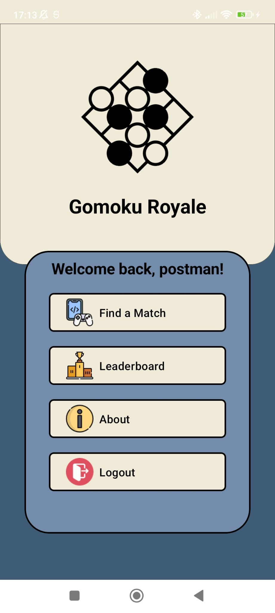
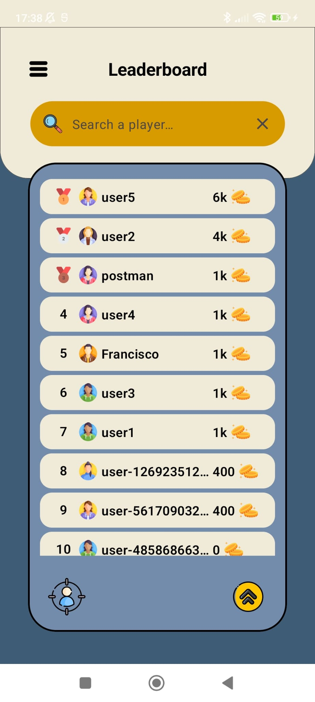
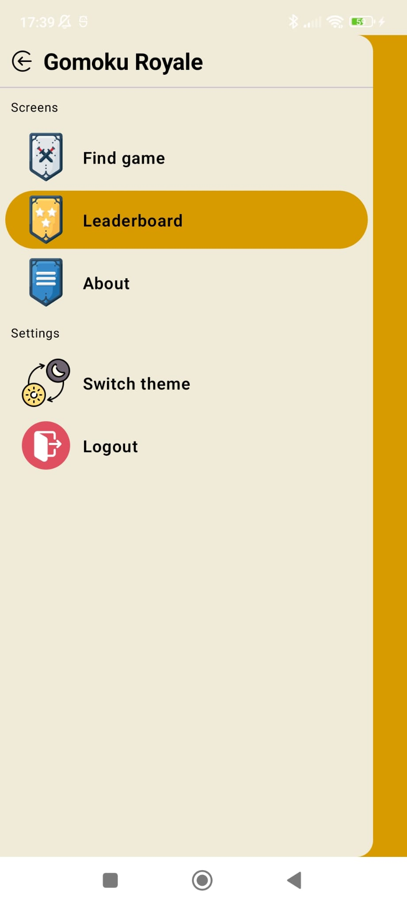
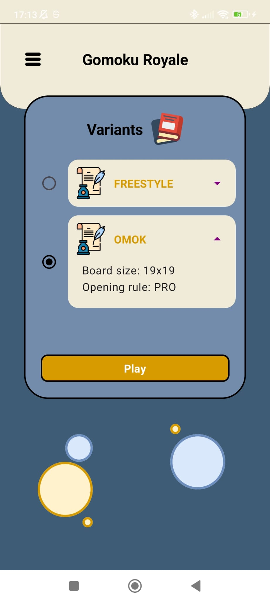
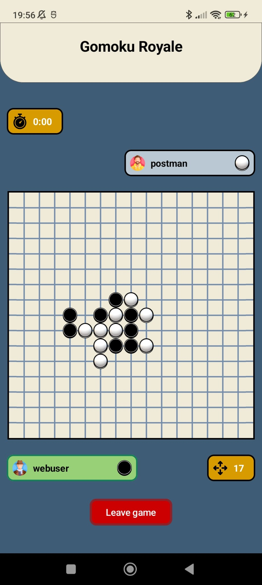
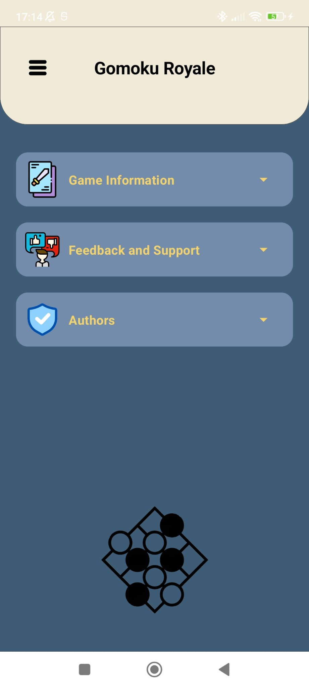

# Gomoku Royale 🉐

> A mobile application that allows users to play the [Gomoku](https://en.wikipedia.org/wiki/Gomoku)
> game.

|  |
|:-----------------------------------------------:|
|                 *Gomoku Royale*                 |

## Introduction

Gomoku Royale is a captivating mobile application that brings the timeless strategy game of Gomoku to your Android device. 
Engage in thrilling one-on-one matches against players from around the globe, strategically placing your stones on the board to form five-in-a-row and claim victory.

For more information about the application structure and design, see
the [documentation](docs/documentation.md).

## Demo

This short video demonstrates the application in action:

https://github.com/isel-leic-pdm/gomoku-2023-g22/assets/101189781/6d0d469a-a4a7-4fe7-8308-c15f9921fa21

## Features

The application has the following features:

- Register or log in to access the game lobby and match with other players.
- View and search the leaderboard to track your progress and compete with others.
- Analyze your individual statistics to identify areas for improvement.
- Adjust the theme between a `light ☀️` and `dark 🌑` theme in the settings menu, to suit your
  preferences.
- Multilingual support ensures that you can enjoy the game's immersive experience in a language that
  feels most comfortable. Currently supported languages include `English`, `Portuguese`
  and `German`.

## Screens

Here are some screenshots of the application screens:

    
    
    

    
    
    

### Authors

- Diogo Rodrigues - 49513
- Tiago Frazão - 48666
- Francisco Engenheiro - 49428

---

Instituto Superior de Engenharia de Lisboa 
Programming in Mobile Devices 
Winter Semester of 2023/2024
