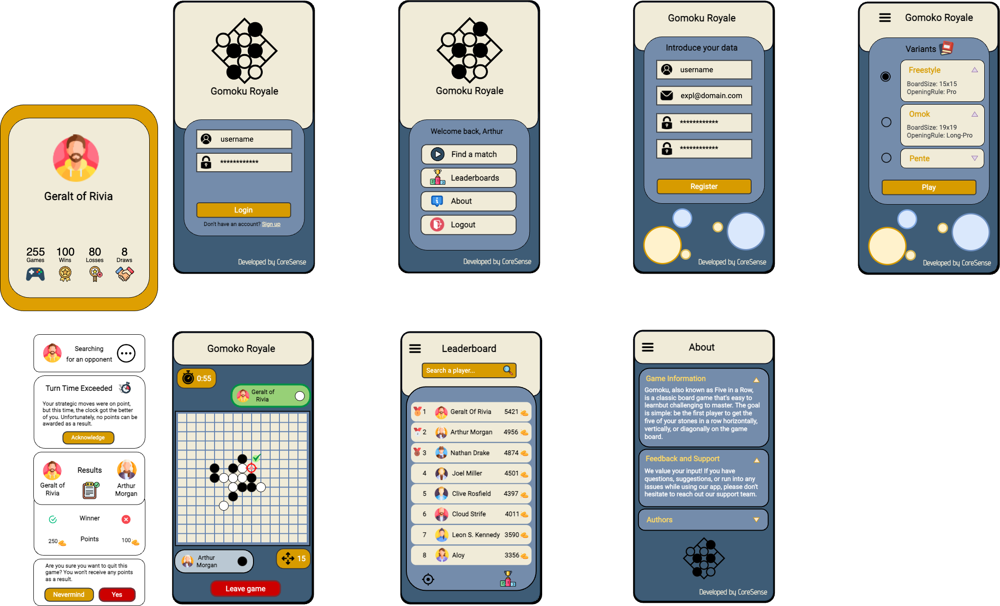
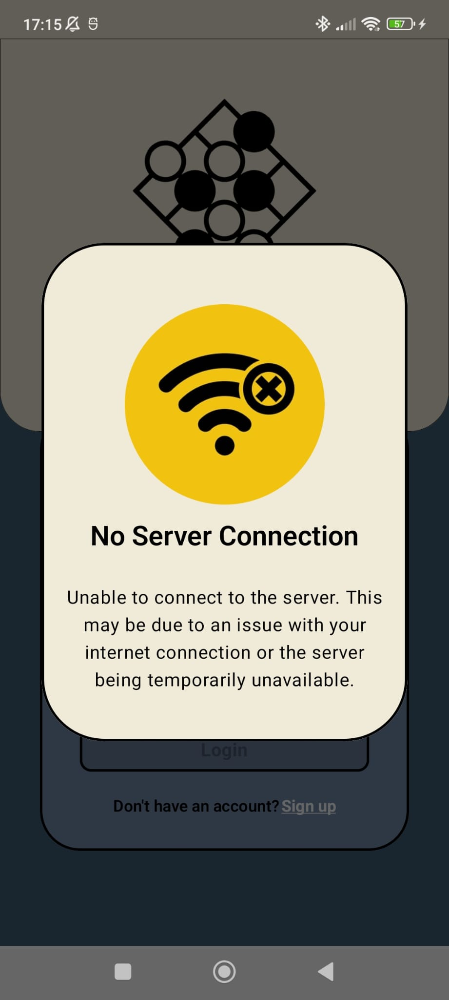

# Gomoku Royale 🉐

> This document describes the implementation details of the Gomoku Royale mobile application.

## Table of Contents

- [Introduction](#introduction)
- [Architecture](#architecture)
- [Application](#application)
    - [Screens](#screens)
    - [Language, theme and screen orientation](#language-theme-and-screen-orientation)
    - [Generic Components](#generic-components)
    - [Mockup](#mockup)
- [Connection to the API](#connection-to-the-api)
- [Tests](#tests)
- [Critical Analysis](#critical-analysis)
- [Further Improvements](#further-improvements)

## Introduction

Gomoku Royale is a mobile application that allows users to play
the [Gomoku](https://en.wikipedia.org/wiki/Gomoku) game, also known as
Five in a Row, on their mobile devices. The game is multiplayer and each player plays
on a different device.

## Architecture

The application is implemented using Android with Kotlin
and [Jetpack Compose](https://developer.android.com/jetpack/compose).

The architecture of the application is based on the **MVVM pattern**, which is a
Model-View-ViewModel pattern. The MVVM pattern is a variation of the MVC pattern, where the
controller is replaced by the ViewModel.

The [ViewModel](https://developer.android.com/topic/libraries/architecture/viewmodel) is responsible
for exposing data to the view and handle the user interactions. The ViewModel is also responsible
for handling the communication with the service layer of the application and ensure is not tied to
the Activity lifecycle.

The [app/src/main/java/gomoku](../app/src/main/java/gomoku) folder contains the source code of the
application, which is divided into the following packages:

- `domain`: contains the domain models of the application, as well as services, repositories and
  storage abstractions.
- `http`: contains the HTTP API models of the application and service implementations;
- `infrastructure`: contains the infrastructure models of the application, such as storage
  implementations and serializers;
- `ui`: contains the user interface of the application, which is divided into the following
  packages:
    - `{screenName}`: represents a screen of the application package, which is divided into the
      following packages and files:
        - `components`: contains the components of the screen;
        - `{screenName}Activity.kt`: contains the activity of the screen;
        - `{screenName}ViewModel.kt`: contains the ViewModel of the screen;
        - `{screenName}Screen.kt`: contains the screen (Jetpack Compose UI);
        - `{screenName}State.kt>`: contains the state of the screen, which is represented by a
          sealed class.
    - `shared`: represents the shared components of the application, which is divided into the
      following packages and files:
        - `components`: contains the generic components of the application;
        - `theme`: contains the theme colors and schemas of the application;
        - `dialogs`: contains the dialogs and popups of the application;
        - `background`: contains the background model and component of the application;
        - `BaseViewModel.kt`: contains the base ViewModel of the application.
- `GomokuApplication.kt`: contains the application class of the application which implements
  the `Application` interface and the `GomokuDependencyProvider` interface;
- `GomokuDependencyProvider.kt`: responsible for providing the dependencies of the application;

In the development process of the application, fake services were created to simulate the
communication with the API.

## Application

### Screens

The application has the following screens:

- Home Screen
- About Screen
- Login Screen
- Register Screen
- Leaderboard Screen
- Variants Screen
- Game Screen

Some screens have a **navigation drawer**, which can be opened by clicking the `hamburger icon` in
the
top left corner of the screen, while others can have one or multiple **dialogs**.

### Language, theme and screen orientation

The game is available in three languages: `English`, `Portuguese` and `German`.

The application has a `light ☀️` and `dark theme 🌑`, which can be changed in the `settings` menu,
which is available in most screen's navigation drawer.

The application is only available in `portrait mode`.
The `landscape mode` is not supported, has it was not implemented during the development of the
application. Even though the application does not **block it**, users are advised to use the
application in `portrait mode` for a better user experience.

### Generic Components

The application has some generic components that are used in multiple screens of the application,
the most relevant ones are:

- [Background](../app/src/main/java/gomoku/ui/shared/background/Background.kt): represents the
  background of the application, and was designed to be tailored to the many screens of the
  application;
- [Form](../app/src/main/java/gomoku/ui/shared/components/Form.kt): represents a form component,
  which can be used to create forms in the application.

All components located in the [shared/components](../app/src/main/java/gomoku/ui/shared/components)
package were designed to be generic, reusable, customizable and independent of the screen they are
used in.

### Mockup

In the development of the application, a mockup was created to help visualize and structure the
application's screens. The mockup was created in [Draw.io](https://app.diagrams.net/).

Below is a visual representation of the latest version:

|  |
|:---------------------------------------:|
|             *Gomoku Mockup*             |

## Connection to the API

The application communicates with the API using the [OkHttp](https://square.github.io/okhttp/)
library, which is an `HTTP client` for Android and Java.

To abstract the communication with the API, the application uses the
[ApiConnection](../app/src/main/java/gomoku/http/utils/ApiConnection.kt) class, which is responsible
for
making the HTTP requests to the API and parsing the responses into the corresponding models.

The service layer of the application is responsible for communicating with the API. In
the [service](../app/src/main/java/gomoku/http/service) package, there are few services:

- `ApiGameService`: responsible for communicating with the API's game endpoints;
- `ApiUserService`: responsible for communicating with the API's user endpoints;
- `ApiVariantsService`: responsible for communicating with the API's variant endpoints.

Leveraging the capabilities of the API's URL templating, the services mentioned above use utility
functions that build such templates into an actual URI.

The `fetchRecipes` function employs OkHttp to make asynchronous calls, adeptly parsing the responses
into a list of Recipe objects. Its counterpart, `findRecipeUri`, seamlessly navigates stored recipe
URIs based on provided **relations**.

If the server is temporarily unavailable or some internet error occurs, the application displays a
message to the user, informing them of the issue using a dialog like the one below:

    

## Tests

A variety of tests were implemented to ensure the application's correctness and robustness.

We leveraged the [Mockk](https://mockk.io/) library to isolate and test individual components of the
application, enabling us to conduct thorough and efficient testing without the burden of managing
external dependencies.

To facilitate and streamline the testing process for functions that rely on flow emissions, we
developed a set of utility functions that simplify and enhance testability. These functions are
designed to efficiently handle flow subscription, collection, and timeouts, allowing testers to
focus on the specific behavior being tested without the complexities of manual flow orchestration.
These functions can be found in
the [FlowExtensions](../app/src/test/java/gomoku/utils/flows/FlowExtensions.kt) file.

## Critical Analysis

Our application boasts a well-organized structure, ensuring code clarity and ease of comprehension.
While we acknowledge room for enhancement in the documentation, we are confident it currently serves
its purpose for this project.

The primary challenge we faced centered on implementing communication with the API, particularly as
it marked our first encounter with the `Siren Hypermedia` specification.

Tests were also a challenge, as we had to learn ways to test the application's UI, which is
implemented using Jetpack Compose, such as placing tags on components, mocking the dependencies and
working with asynchronous operations and coroutines.

## Further Improvements

What can be improved/added in the future:

- Implement turn counter;
- Implement the landscape (horizontal) mode;
- Improve the documentation;
- Improve dark theme colors and shemas;
- Add custom font;
- Add login with external services (Google, Facebook, etc.);
- Add more integration and UI tests.